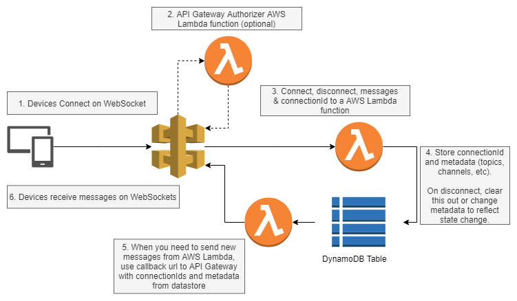
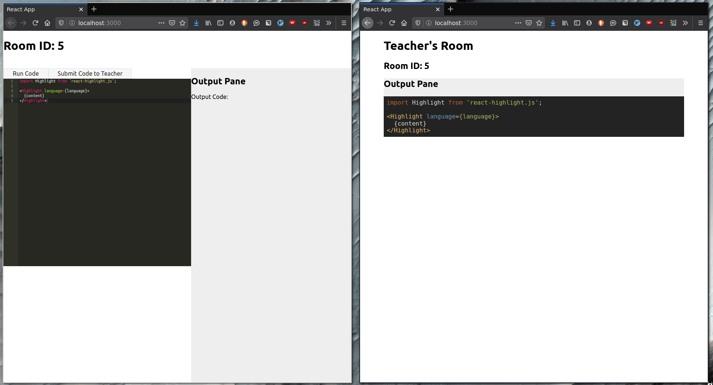

# Introduction

# Task

## Introduction

ThirdSpace is a real-time classroom environment where students can:

- Execute and submit code to instructors.
- Access files and resources (homework) from instructors.
- Chat with each other, and ask questions.
- View real-time or pre-recorded lectures.

Instructors have separate views where they can:

- View submitted code from every student.
- Share their code to the students code editor.
- Post files and resources (homework).
- Create courses with scheduled classes.

## Questions

1. To the best of your abilities, please design a scalable system
   architecture for ThirdSpace. No code needed.
2. Build a simple application with ReactJS and ExpressJS. You may use any JS libraries to your liking. Please see the instructions here.

# My attempt

## Question 1 : Designing a scalable system architecture

I break the monolithic environment into separate services:

1. **Code share+submit service**: Instructors enter private rooms with students,
   and can share solutions with students. Students execute and submit code.
2. **Code viewing service**: A static view for instructors to view submitted code
3. **Chat service**: Real-time chat.
4. **Course view service**: largely static service to display text, images, and videos.
5. **Live stream service**: dedicated service to encode streaming media and chunk it

I'll now go through the overall architecture and show where the individual services fit in.


The overall architecture uses Amazon's API Gateway, AWS Lambda, and Amazon DynamoDB
for scalability. We use these services as we get scalability "for free", although
I also sketch out non-AWS alternatives.

Upon authenticating, students enter the ThirdSpace classroom environment.
The student's client establishes several WebSocket connections to an Amazon API Gateway.
The following WebSocket connections are established through the API Gateway:

1. Chat service WS
2. Code sharing service WS

Additionally, the client also makes the appropriate GET request to the Course view service,
which will display the courses that the students are involved in.

Suppose the student now wants to chat. He will then send messages through
the established WebSocket to the API Gateway which calls an AWS Lambda function.
The waiting AWS Lambda function calls Amazon DynamoDB for the WebSockets
subscribed to the chat channel, and callback to the API Gateway.
The API Gateway then sends payloads through all the other WebSocket connections.



The same principle applies to the code sharing service (we build an MVP in
section 2), which is very similar to the real time chat service. Once again,
students send code through the WebSocket which calls an AWS Lambda function.
The difference is that this function may need to compile the submitted code
(only Javascript can be interpreted client-side) as well. As before, it calls
DynamoDB, and returns payloads to the teacher's Websocket connection.

The course view service can be handled with a normal REST API. We can either
use Amazon's API Gateway with Amazon DynamoDB or a more traditional
architecture running on a server (or multiple servers).

If we want a more traditional approach: students send GET requests to the
server, and instructors who wish to upload course materials can make a POST
request to the server. We can ensure scalability by using a load balancer,
and course materials can be stored in some shared database.

Finally, live streaming should be handled with HTTP Live Streaming (HLS).
The following diagram from [Apple's developer documentation](https://developer.apple.com/documentation/http_live_streaming) lays out all the moving parts:


We should use a dedicated server to receive AV input from instructors,
do the encoding and stream segmentation
(this could be farmed out to Lambda functions)
and serve them out to the clients.

## Question 2: Build a code sharing view with React and ExpressJS.

The code for the app is on a private repository [here](https://github.com/lieuzhenghong/Xccelerate-Engineering-Test).

This is what an old version of the app looks like (GIF):



There is a React app running on port 3000 and an Express server running on port 3333. Clients communicate with the server using a bidirectional WebSockets connection. The server contains a list of Rooms and can handle actions (instead of routes) such as join (a room), leave (a room), run (some code), and share (some code).
We can see that the teacher's view updates in real-time as the student
submits his or her code.

Below is the backend schema:

### Room

This lives in memory but should be stored in a datastore.

```javascript
class Room {
  id: string;
  teacher: Username;
  student: Username;
  sharedCode: string;
  teacher_ws: WebSocket;
  student_ws: WebSocket;
}
```

### Actions

- "JOIN" -- join a room
- "LEAVE" -- leave a room
- "RUN" -- run some code (Student view only)
- "SHARE" -- submit some code to the Teacher in the room (Student view only)

#### Schema for each WebSocket request from client --> server

```javascript
{
  username: Username (just a string),
  action: "JOIN" | "LEAVE" | "RUN" | "SHARE",
  roomId: RoomID (just a string) | null
  role: "Student" | "Teacher" | null

  // This is action specific
  // If action is "JOIN":
  payload: {
    roomId: RoomID
    role: "Student" | "Teacher"
  }

  // or if action type is Leave, payload is
  payload: {
    roomId: RoomID
    role: "Student" | "Teacher"
  }

  // or, if action type is Run, payload is
  payload: {
    code: a JS string that can be run
    }

  // or, if action type is Submit, payload is
  payload: {
    shared_code: a JS string corresponding to input code
    }
}
```

### How does the server respond to each type of action?

#### If action === "JOIN":

1. Look at the payload and check whether:

- The room exists
- If the room exists, whether the role is taken

2. Return the Room object or an error message

#### If action === "LEAVE" (NOT IMPLEMENTED):

- check whether the person is actually in the room with that role
- return either some acknowledgement or return an error message

#### If action === "RUN" (IMPLEMENTED BUT NOT USED):

1. Take the payload code and run it on an interpreter
2. Return the outcome of the code (could be an error, or some output)

#### If action type === "SHARE":

1. Take the payload code and broadcast it to the other person in the room

### What sort of messages can a client expect to receive?

```javascript
{
  responseType: "JOIN" | "LEAVE" | "RUN" | "SHARE" | "ERROR" ,
  room: Room,

// again, action dependent
// if response_type === "JOIN"
// empty
  payload: {
    role: "Student" | "Teacher"
  },

  // if response_type === "RUN"
  payload: {
    codeOutput: string,
  },

  // if response_type === "SHARE"
  payload: {
    shared_code: string,
  },

  // if response_type === "ERROR"
  payload: {
    error_message: string,
  }
}
```

### FAQs

**Why no tests?** I didn't put them in due to time contraints, but I should have.

**Why no routes (GET/POST)?** Given that the app needed real-time bidirectional communication between client and server, I decided to use WebSockets. And if we use WebSockets we don't really need routes because WebSockets allows us to send arbitrary JSON very quickly.
